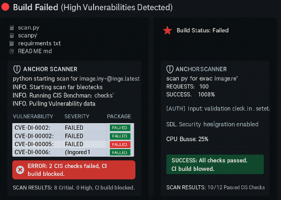

# 🛡️ Container Image Vulnerability Scanner

**Container Image Vulnerability Scanner** is a lightweight **Python + Docker** security tool that:
-  Scans container images for known CVEs using the **OSV.dev vulnerability database**.
-  Analyzes Dockerfiles for insecure patterns and **CIS Docker Benchmark** issues.
-  Integrates with **CI/CD pipelines** to block vulnerable builds before deployment.

---

##  Why This Project?

Modern development cycles demand **speed + security**.
- Traditional scanners are **slow**, **resource-heavy**, or locked behind enterprise paywalls.
- Security checks often run **after deployment**, instead of at build time.

 This project is built for **developers first**:
- Runs **in seconds**, not minutes.
- Works **locally and in CI/CD**.
- Easy to extend (Python modules, simple regex-based Dockerfile checks).

---

##  Example Scan Results

### 🔴 Build Failed (High Vulnerabilities Detected)
.

_This example shows automated CI/CD responses based on vulnerability severity._

---

##  Architecture

`	ext
   +-------------------+
   |   Docker Image    |
   +---------+---------+
             |
             v
   [ Package Discovery ]  --->  OSV.dev Vulnerability DB
             |
             v
   +-------------------+        +--------------------+
   | Dockerfile Parser | -----> | CIS-like Rule Set  |
   +---------+---------+        +--------------------+
             |
             v
   [ Policy Engine ] ---> Pass/Fail ---> CI/CD Pipeline
 Getting Started
Prerequisites
Python 3.9+

Docker 20.10+

pip for dependencies

Installation
bash
Copy code
git clone https://github.com/adit019/container-vuln-scanner.git
cd container-vuln-scanner
python -m venv .venv
source .venv/bin/activate    # Windows: .venv\Scripts\activate
pip install -r requirements.txt
 Usage
1) Scan a Docker Image
bash
Copy code
python scanner/cve_scanner.py --image ubuntu:22.04 --fail-on HIGH
2) Check Dockerfile Security
bash
Copy code
python scanner/dockerfile_parser.py --file ./Dockerfile
 CI/CD Integration
GitHub Actions
yaml
Copy code
name: security-scan
on: [pull_request]
jobs:
  scan:
    runs-on: ubuntu-latest
    steps:
      - uses: actions/checkout@v4
      - uses: actions/setup-python@v5
        with:
          python-version: '3.11'
      - run: pip install -r requirements.txt
      - run: python scanner/dockerfile_parser.py --file Dockerfile
      - run: python scanner/cve_scanner.py --image my-app:latest --fail-on HIGH
GitLab CI
yaml
Copy code
vulnerability_scan:
  stage: test
  script:
    - pip install -r requirements.txt
    - python scanner/cve_scanner.py --image my-app:latest --fail-on HIGH
 Example Output
bash
Copy code
[INFO] Detected package manager: dpkg
[INFO] Packages discovered: 152

PACKAGE    VERSION   SEVERITY   EXAMPLES
----------------------------------------
libc6      2.31      HIGH       CVE-2021-1234, CVE-2022-5678

[FAIL] Highest severity >= HIGH. Blocking build.
⚙️ CLI Options
FlagDescription
--imageDocker image to scan (required for CVE scan).
--fail-onPolicy threshold: LOW / MEDIUM / HIGH / CRITICAL (default: HIGH).
--filePath to Dockerfile for static analysis.
--jsonOutput results in JSON for machine integration (coming soon)
--ignoreIgnore specific CVEs (coming soon)

 Testing
bash
Copy code
pytest -q

 Tech Stack
Python (CLI, rules engine)

Docker CLI (container inspection)

OSV.dev API (vulnerability DB)

PyTest (tests)

GitHub Actions / GitLab CI (CI/CD integration)

 Roadmap
 ---
 JSON output for dashboards

 Ignore list for specific CVEs

 Multi-stage Dockerfile scanning

 OVAL feed enrichment (RedHat, Alpine secdb)

 REST API server (FastAPI) for integration with dashboards
 
 Security Policy
 ---
Please see SECURITY.md.
If you find a security vulnerability, please report it responsibly.

##  License
Copyright © 2025 Adit Sharma.  
All rights reserved.

This project and its source code are proprietary and confidential.  
Unauthorized copying, modification, distribution, or use of this software, via any medium, is strictly prohibited without prior written permission from the author.

